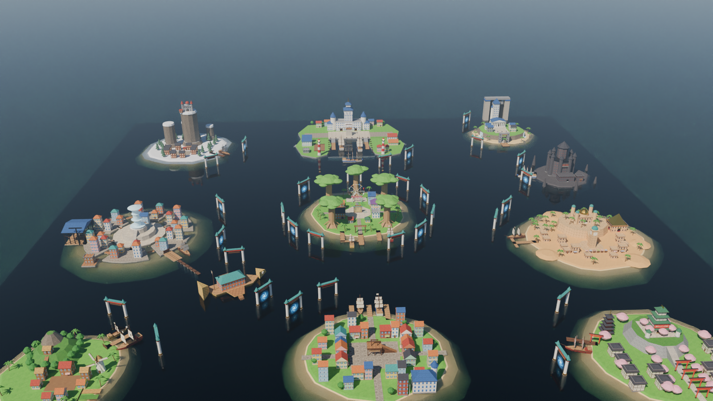

# rp_onepiece_grandline : map RP One Piece pour Garry's Mod

Une grande map maritime pour serveur RP One Piece. On y trouve **11 lieux emblématiques** répartis sur un océan
de 32 000 × 32 000 unités (la taille maximale du moteur Source). Les îles sont reliées par des
**Portes de la Grand Line** : des arches flottantes qui téléportent les joueurs et leurs navires d'une île à l'autre.



| | |
|---|---|
|  |  |
|  |  |
|  |  |
|  |  |
|  |  |
|  |  |
|  |  |
|  |  |

*Rendus Blender (Cycles) faits à partir de la géométrie exacte des brushes de la map.*

---

## Les lieux

| Île | Ce qu'on y trouve |
|---|---|
| **Archipel de Sabaody** (centre, spawn) | Place centrale avec la carte du monde, 5 mangroves géantes numérotées (Grove 1, 13, 24, 41, 70), bulles flottantes, **grande roue qui tourne** (Sabaody Park), Maison des ventes, bar de Shakky, atelier de coating, hôtel, boutiques, poste de la Marine, 3 quais avec le Going Merry et le Red Force. **Plaque tournante : portails vers toutes les îles.** |
| **Marineford** (nord) | Île en croissant autour d'une baie. QG de la Marine avec la tour 海軍 / 正義, tours rondes, place d'Oris et son échafaud, 3 navires de guerre, casernes, arsenal, terrain d'entraînement, hôpital, cantine, phares, canons sur les quais. **Murs de siège** qui sortent de la mer (bouton rouge dans le hall du QG). |
| **Enies Lobby** (nord-est) | Plateau sur falaises avec cascades, porte principale et grand escalier, tribunal à colonnes, pont de l'Hésitation, **Tour de la Justice**. Au large : les **Portes de la Justice** (portail vers Impel Down) et une porte vers Marineford. |
| **Impel Down** (est) | Forteresse sombre à 8 tours, **bloc de 6 cellules** à barreaux coulissants (verrouillables), bureau du directeur, quai militaire, rochers acérés. |
| **Alabasta** (est) | Île désertique, **palais d'Alubarna** sur son plateau (dôme doré, 4 tours), tour de l'horloge, ville en grès, marché, casino **Rain Dinners** (pyramide dorée), oasis entourée de palmiers, port. |
| **Pays de Wano** (sud-est) | **Château du shogun** à 4 étages sur des remparts de pierre, allée de torii rouges, quartier de maisons japonaises (izakaya, dojo, forgeron, ryokan), pagode à 5 étages, cerisiers en fleurs. |
| **Loguetown** (sud) | Ville colorée aux rues pavées, **échafaud de Gol D. Roger** sur la place, base de la Marine (Smoker), armurerie Ipponmatsu, tailleur, bar, banque, journal, boulangerie, médecin, port. |
| **Village de Fuchsia** (sud-ouest) | Village d'East Blue : **Party's Bar** (Makino), mairie, maisons, **moulin à vent qui tourne**, champs, mont Corvo et sa forêt avec le repaire de Dadan. |
| **Baratie** (en mer) | Le restaurant flottant en forme de poisson : salle de restaurant, nageoires de combat, escaliers pour sortir de l'eau. |
| **Water Seven** (ouest) | Cité sur canaux : 6 quartiers reliés par des ponts, paliers centraux, **grande fontaine**, Galley-La Company, **Dock 1** (chantier naval avec grue), Franky House, gare du Puffing Tom. |
| **Royaume de Drum** (nord-ouest) | Île d'hiver : Drum Rockies (pics cylindriques), **château de Drum** au sommet, téléphérique, village de Bighorn (taverne, clinique, magasin), forêt de sapins enneigés. |

À l'horizon, le skybox 3D prolonge l'océan à l'infini et montre la **Red Line** dans la brume, au nord.

Toutes les coordonnées (bâtiments, lieux, portails, points d'arrivée) sont dans **[LIEUX.md](LIEUX.md)**.

---

## Se déplacer : les Portes de la Grand Line

Chaque île a des arches flottantes en mer, avec un panneau qui indique leur destination (« → MARINEFORD »).
Il suffit de traverser la membrane bleue, à la nage ou en bateau, pour arriver au port de l'île de destination.

* **Sabaody** a un portail vers **chacune** des 10 autres îles.
* Chaque île a un portail **retour vers Sabaody** et un portail vers **l'île suivante de la route**, qui suit l'ordre de l'histoire :
  Fuchsia → Baratie → Loguetown → Drum → Alabasta → Water Seven → Enies Lobby → Sabaody → Impel Down → Marineford → Wano → Fuchsia.
* **Enies Lobby** : les Portes de la Justice mènent à Impel Down, et une porte mène à Marineford.

On peut aussi naviguer librement : toutes les îles sont dans le même océan.

**Navires entiers :** avec le fichier `addon/lua/autorun/server/sv_onepiece_seagates.lua`, un bateau construit
(props soudés, sièges, véhicules, joueurs à bord) est téléporté en entier, dans le bon sens et avec sa vitesse.
Sans ce fichier, la map téléporte quand même les joueurs grâce aux `trigger_teleport` classiques.

---

## Mécanismes RP

| Élément | Détails |
|---|---|
| **Portes** | 94 portes `func_door_rotating` : on les ouvre avec la touche « Utiliser », et elles peuvent appartenir à un joueur ou être verrouillées avec DarkRP. |
| **Cellules d'Impel Down** | 6 portes à barreaux coulissantes (`func_door`), nommées `impel_cellule_1` à `impel_cellule_6`. |
| **Murs de siège de Marineford** | 3 murs (`marineford_murs`) cachés sous l'eau à l'entrée de la baie. Le bouton rouge du hall du QG les fait monter ou descendre. |
| **Téléphérique de Drum** | Une cabine au village vous emmène au château, une autre au sommet vous ramène en bas. |
| **Décors animés** | La grande roue de Sabaody et le moulin de Fuchsia tournent (`func_rotating`). |
| **Spawns** | 24 `info_player_start` sur la place de Sabaody. Des `info_target` nommés `spawn_marine` (place d'Oris) et `spawn_pirate` (Fuchsia) servent de repères pour les métiers. |
| **Intérieurs** | La plupart des bâtiments ont une porte, un intérieur éclairé et des meubles. Certains ont un étage (rampe intérieure). |

### Conseils DarkRP
* Lancez le serveur sur la map : `+map rp_onepiece_grandline` dans la ligne de commande ou `server.cfg`.
* Spawns par métier : placez-vous à l'endroit voulu (par ex. place d'Oris pour la Marine, voir `LIEUX.md`) et tapez
  `/setspawn <commande_du_metier>`.
* Pour réserver des portes à la Marine (QG, casernes) ou au gouvernement (Impel Down, Enies Lobby), créez des groupes de portes
  (`darkrp_customthings/doorgroups.lua`), puis assignez-les en jeu avec le menu des portes (F2 en regardant la porte, en admin).

---

## Compiler la map (Windows)

Le dépôt contient la **source Hammer** (`maps/src/rp_onepiece_grandline.vmf`) et les **textures**.
Il faut la compiler en `.bsp` une fois :

**Option A : script fourni**
1. Ouvrez `compile.bat` et vérifiez le chemin `GMOD` (dossier d'installation de Garry's Mod).
2. Double-cliquez sur `compile.bat`. Il copie les textures, lance VBSP, VVIS et VRAD, puis intègre les textures dans le BSP avec bspzip.
3. Le fichier `rp_onepiece_grandline.bsp` arrive dans `garrysmod/maps/` et dans `addon/maps/`.

**Option B : [CompilePal](https://compilepal.ricochet.dev)** (recommandé, avec interface)
1. Copiez `addon/materials` dans `garrysmod/materials`.
2. Dans CompilePal, choisissez Garry's Mod, ajoutez le VMF, puis cochez VBSP, VVIS, VRAD (`-both -final`) et PACK.

**Après la compilation (une seule fois)**, en jeu : `map rp_onepiece_grandline`, puis
`sv_cheats 1`, `mat_specular 1` et `buildcubemaps`. Ça génère les reflets de l'eau et des métaux.

> Vous pouvez aussi ouvrir le VMF dans Hammer (ou Hammer++) pour le modifier. Chaque île est dans son propre
> **visgroup** : on peut afficher ou masquer chaque île séparément.

## Installer sur un serveur

* **Addon local** : copiez le dossier `addon/` (avec `maps/rp_onepiece_grandline.bsp` dedans) vers
  `garrysmod/addons/rp_onepiece_grandline/`.
* **Workshop** : `gmad.exe create -folder addon -out rp_onepiece_grandline.gma`, puis publiez avec `gmpublish`.
  Ajoutez `resource.AddWorkshop("<id>")` côté serveur pour que les joueurs téléchargent la map.
* Le script Lua des portails est dans l'addon : il se charge tout seul côté serveur.

---

## Contenu du dépôt

```
maps/src/rp_onepiece_grandline.vmf   source Hammer de la map (à compiler)
maps/src/packlist.txt                liste des fichiers à intégrer dans le BSP (bspzip)
addon/                               addon GMod : textures (materials/onepiece), Lua des portails, addon.json
compile.bat                          compilation automatique (Windows)
LIEUX.md                             coordonnées de tous les lieux, portails et arrivées
previews/                            rendus Blender
blender/rp_onepiece_grandline.blend  scène Blender de la map complète (+ textures/)
tools/mapgen/                        générateur Python de la map
```

## Modifier ou régénérer la map (Python)

Toute la map est générée par du code : formes, bâtiments, textures, portails. Vous pouvez modifier une île dans
`tools/mapgen/islands/<ile>.py`, puis régénérer :

```bash
pip install numpy scipy pillow srctools
python -m tools.mapgen.build            # VMF + textures + LIEUX.md
python -m tools.mapgen.build --no-tex   # plus rapide, sans regénérer les textures
```

Le générateur vérifie automatiquement :
* la validité de chaque brush, calculée comme le fait VBSP ;
* les limites du moteur ;
* la jouabilité : spawns et points d'arrivée non bloqués, portes dégagées des deux côtés, passage des portails libre.

Fichiers principaux :
* `layout.py` : position des îles, routes et portails
* `kit.py` : bâtiments, toits, arbres, navires, portails, mobilier
* `materials.py` / `texgen.py` : textures procédurales (VTF/VMT)
* `render_blender.py` : rendus Blender

### Rendus Blender
Ouvrez `blender/rp_onepiece_grandline.blend` : la scène contient une caméra par lieu (`Camera_<lieu>`).
Pour refaire les rendus : `pip install bpy pyoidn OpenEXR`, puis `python tools/mapgen/render_blender.py`
(après un build, qui produit la géométrie `tools/mapgen/build/preview.json`).

---

## Chiffres et limites

* 4 113 brushes (limite Source : 8 192), 32 791 faces de brush (limite : 65 536) et environ 1 170 entités.
  Les lumières, les `func_detail` et les `prop_static` disparaissent à la compilation.
* Presque tout est en `func_detail`, ce qui rend VVIS rapide. Le brouillard marin limite le coût d'affichage des îles lointaines.
* Les meubles utilisent uniquement des modèles de Half-Life 2 et PHX, déjà inclus dans Garry's Mod.
* **Pas encore testée en jeu** : la map n'a pas pu être compilée ici, car les outils Source n'existent que sous Windows.
  Elle a été vérifiée par le générateur (géométrie, jouabilité) et relue avec `srctools`. Lors de la première compilation,
  regardez le fichier `.log`. Si un problème apparaît, il se corrige généralement dans le code de l'île concernée.
