# rp_onepiece_grandline : map RP One Piece pour Garry's Mod

Une grande map maritime pour serveur RP One Piece, organisée en **3 niveaux (3 mers)**.
Dans chaque mer, des îles emblématiques sont éloignées les unes des autres, et **il faut un bateau pour se déplacer**.
Au bord de chaque mer, **deux énormes rochers** encadrent un passage : un bateau qui passe entre eux arrive dans la mer suivante.

## ⚓ Installer la map dans Garry's Mod (Windows, 3 étapes)

1. **Télécharger** la map :
   [rp-one-piece.zip](https://github.com/totoveveav-gif/rp-one-piece/archive/refs/heads/claude/serene-knuth-b995j5.zip),
   puis faire clic droit sur le fichier, « Extraire tout ».
2. **Double-cliquer sur `INSTALLER.bat`** dans le dossier extrait. Il :
   - trouve Garry's Mod tout seul (via Steam) ;
   - compile la map avec les outils fournis avec GMod. **Ça prend de 10 à 40 minutes**, laissez la fenêtre ouverte ;
   - installe la map dans `garrysmod/maps`, et les textures et scripts dans `garrysmod/addons/rp_onepiece_grandline`.
3. **Lancer Garry's Mod**, puis « Nouvelle partie » et choisir **rp_onepiece_grandline**.
   La première fois, ouvrez la console et tapez `sv_cheats 1`, puis `mat_specular 1`, puis `buildcubemaps`
   (ça calcule les reflets de l'eau, une seule fois).

> Si Garry's Mod n'est pas trouvé, l'installateur demande le chemin du dossier `GarrysMod`.
> Si `vbsp.exe` manque, dans Steam : clic droit sur Garry's Mod, puis Propriétés, Fichiers installés,
> « Vérifier l'intégrité des fichiers ».
> Un journal de l'installation est écrit dans `%TEMP%\rp_onepiece_build\installation.log`.

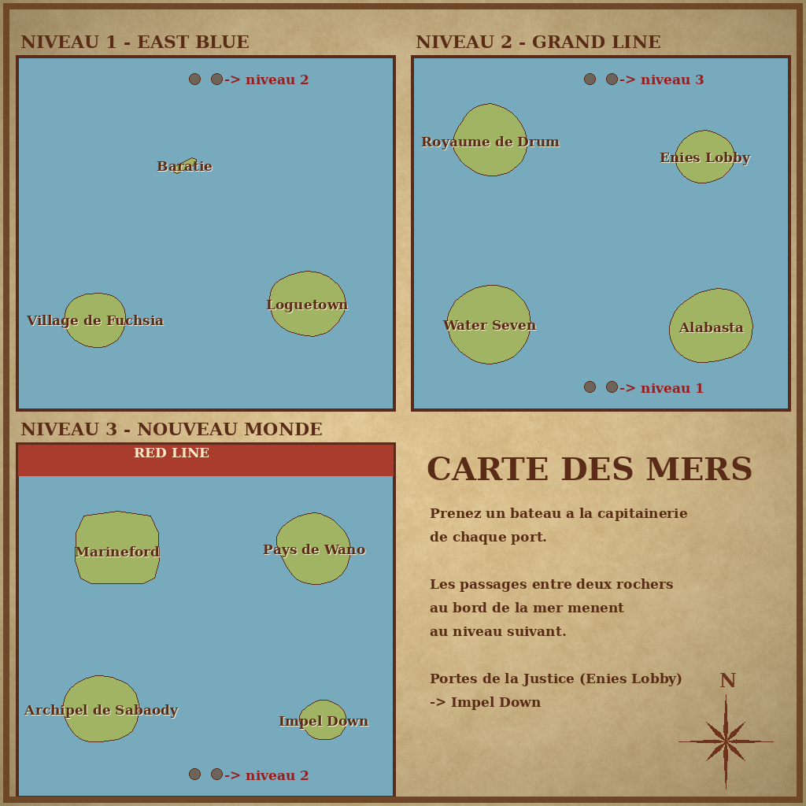

| Niveau | Mer | Îles |
|---|---|---|
| **1** | East Blue (départ) | Village de Fuchsia, Baratie (restaurant flottant), Loguetown |
| **2** | Grand Line | Royaume de Drum, Water Seven, Alabasta, Enies Lobby |
| **3** | Nouveau Monde | Archipel de Sabaody, Marineford, Impel Down, Pays de Wano, avec la **Red Line** qui ferme le nord |

Chaque niveau est un océan complet de 32 000 × 32 000 unités. Les 3 niveaux sont empilés dans la même map, chacun
dans sa propre zone étanche : on ne voit jamais les autres niveaux, et seul le niveau où l'on se trouve est affiché,
ce qui est bon pour les performances.

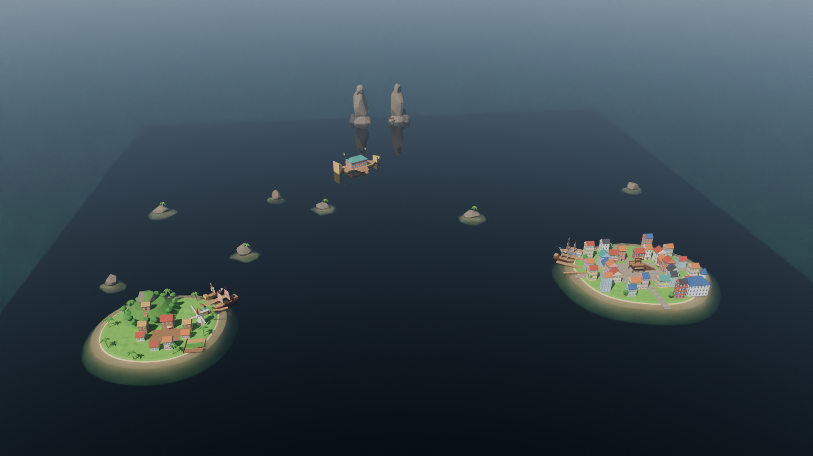

| | |
|---|---|
| 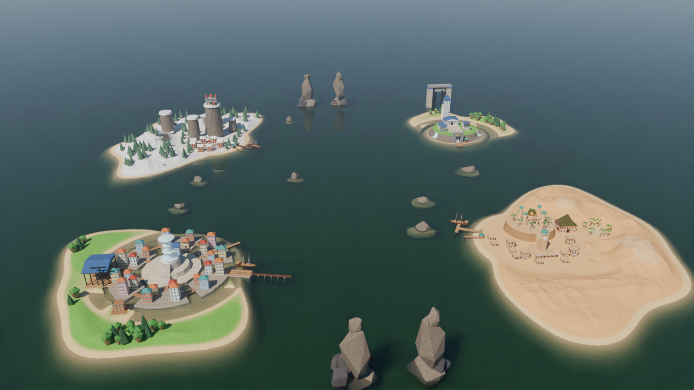 | 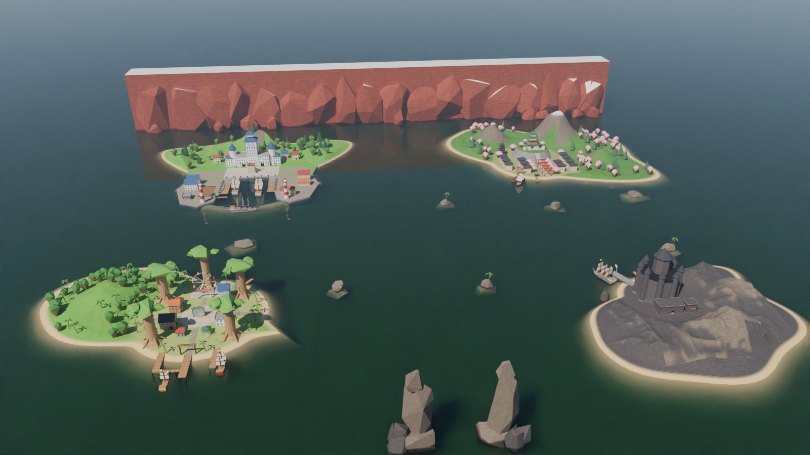 |
|  |  |
| 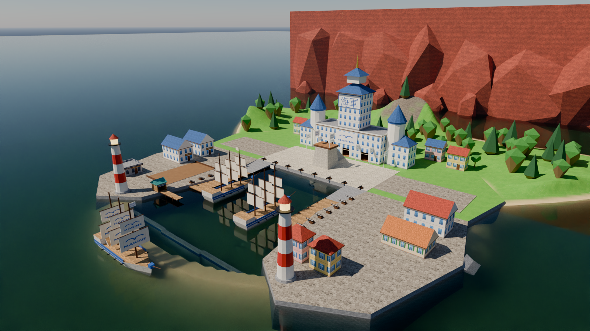 |  |
| 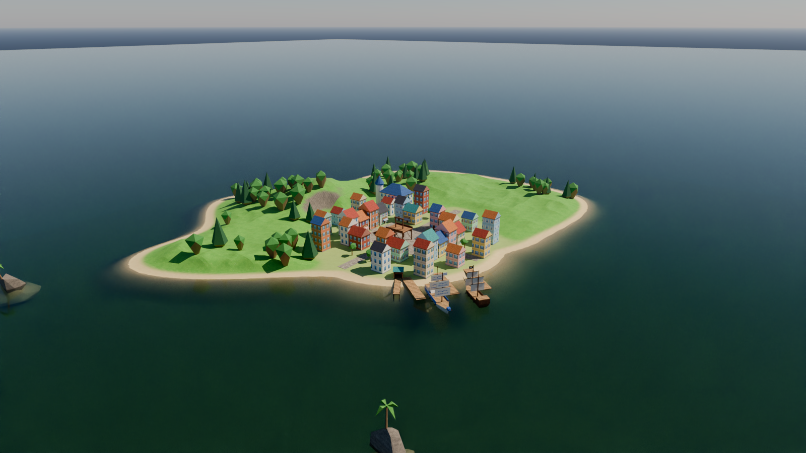 |  |
| 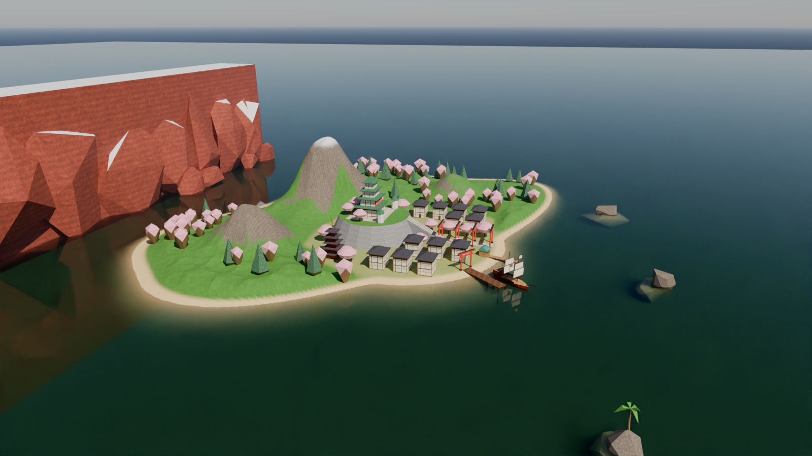 |  |
| 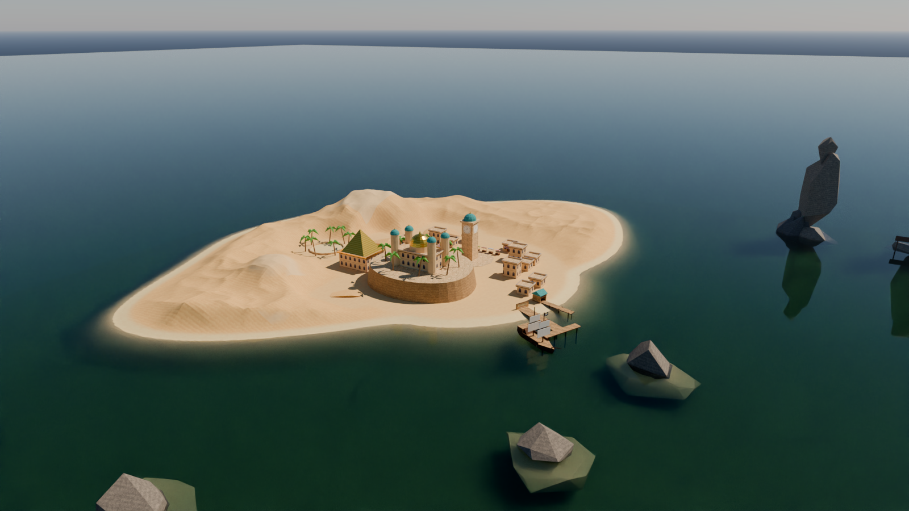 | 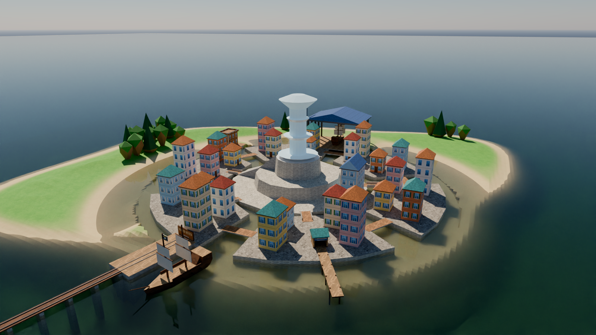 |
| 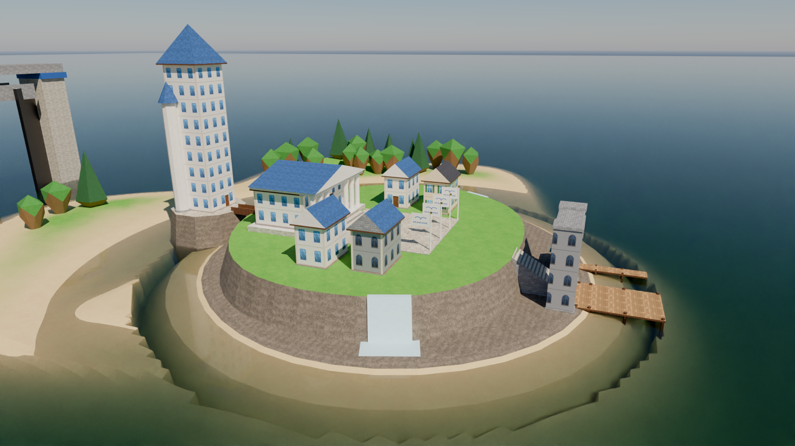 | 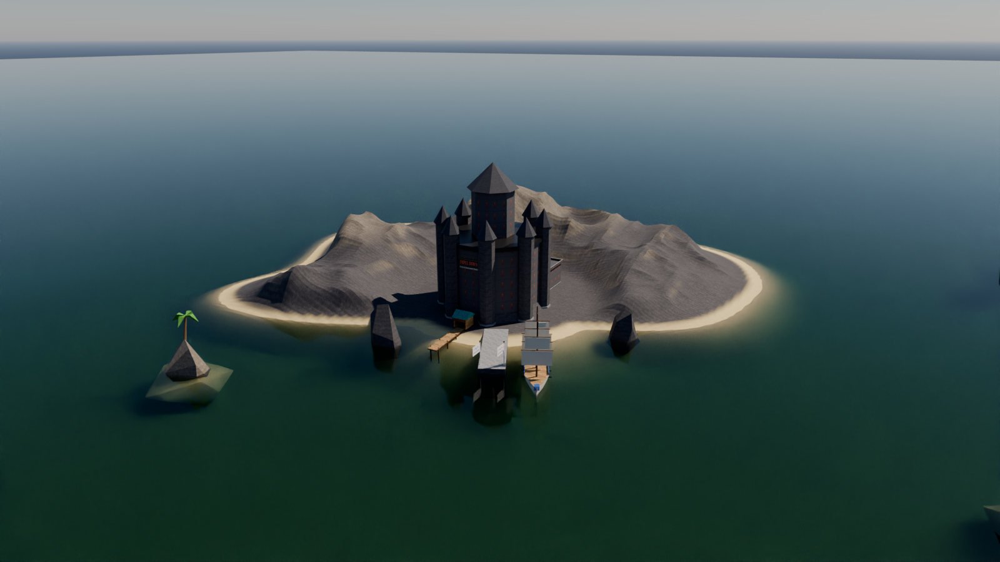 |
| 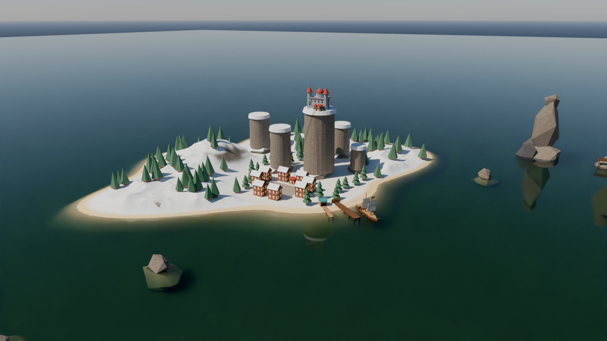 | 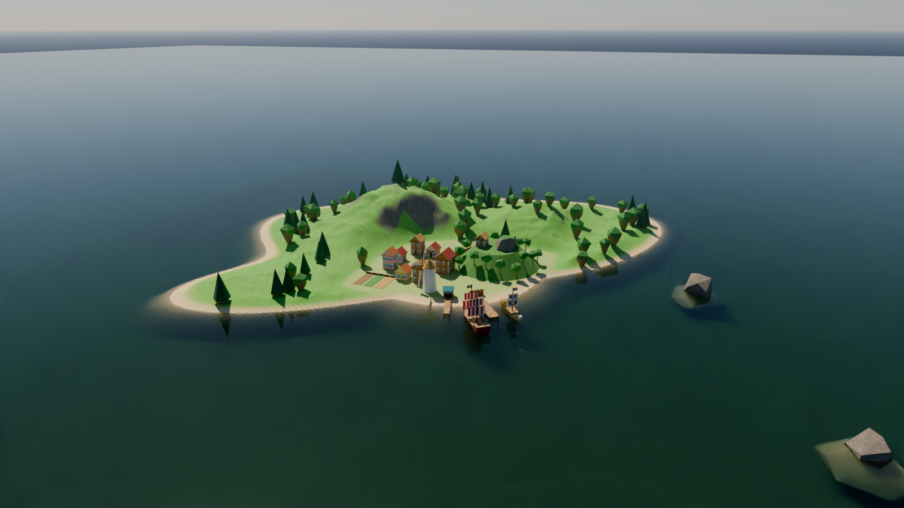 |
| 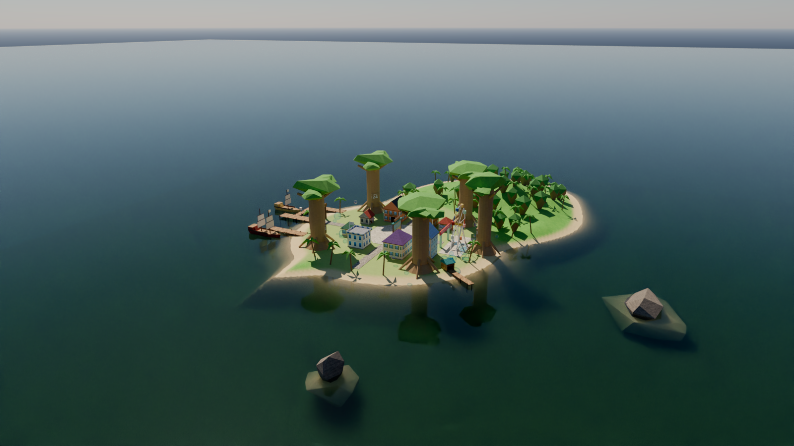 |  |
| 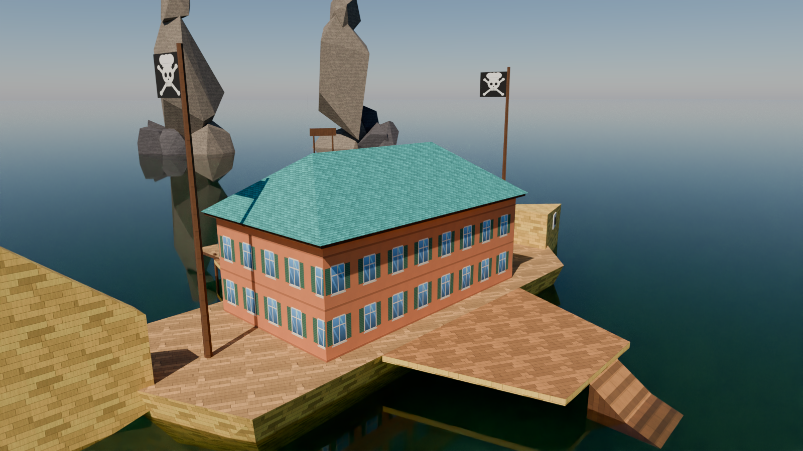 |  |
|  |  |
|  |  |
|  | |

*Rendus Blender (Cycles) faits à partir de la géométrie exacte des brushes de la map.*

---

## Naviguer

1. **Prendre un bateau** : chaque port a une **capitainerie** (cabane au toit vert avec un ponton).
   Le bouton rouge « LOUER UN BATEAU » fait apparaître un bateau au bout du ponton.
2. **Naviguer** jusqu'à une autre île du même niveau. Elles sont éloignées et visibles à l'horizon, dans la brume marine.
3. **Changer de mer** : au bord nord de la mer (et au bord sud pour revenir en arrière), deux énormes rochers
   encadrent une brume bleue avec un panneau (« → GRAND LINE, Niveau 2 »). Passez entre les rochers **en bateau**.
   Tout le navire arrive dans l'autre mer, équipage compris : props soudés, sièges, véhicules et joueurs à bord.
4. **Portes de la Justice** (Enies Lobby, niveau 2) : elles mènent directement à Impel Down (niveau 3), pour les transferts de prisonniers en RP.

À la nage, on ne franchit pas les passages : un message rappelle de louer un bateau.

---

## Les îles

| Île | Ce qu'on y trouve |
|---|---|
| **Village de Fuchsia** (N1) | Party's Bar (Makino), mairie, maisons, **moulin à vent qui tourne**, champs, mont Corvo et sa forêt avec le repaire de Dadan. |
| **Baratie** (N1) | Le restaurant flottant en forme de poisson (tête et queue), pavillon à toque de cuisinier : salle de restaurant, nageoires de combat, escaliers pour sortir de l'eau, capitainerie. |
| **Loguetown** (N1, spawn) | Ville colorée aux rues pavées, **échafaud de Gol D. Roger** sur la place, base de la Marine (Smoker), armurerie Ipponmatsu, tailleur, bar, banque, journal, boulangerie, médecin, port. |
| **Royaume de Drum** (N2) | Île d'hiver : 6 Drum Rockies (pics cylindriques à sommet enneigé), **château de Drum** au sommet du plus haut avec téléphérique, village de Bighorn aux toits enneigés (taverne, clinique, magasin), forêt de sapins, collines de neige. |
| **Water Seven** (N2) | Cité sur canaux : 6 quartiers reliés par des ponts, ville en paliers jusqu'à la **grande fontaine**, Galley-La Company, **Dock 1** (navire en cale sèche, grue), Franky House, gare du Puffing Tom. |
| **Alabasta** (N2) | Île désertique, **palais d'Alubarna** sur son plateau aux falaises ocre (dôme doré, 4 tours), tour de l'horloge, ville en grès, marché, casino **Rain Dinners** (pyramide dorée) avec son oasis, grand désert de dunes. |
| **Enies Lobby** (N2) | Plateau rocheux sur falaises avec cascades, porte principale et grand escalier, tribunal à colonnes, pont au-dessus du gouffre vers la **Tour de la Justice** sur son pilier. Au large : les **Portes de la Justice**. |
| **Archipel de Sabaody** (N3) | 5 mangroves géantes numérotées, bulles flottantes, **grande roue qui tourne**, Maison des ventes, bar de Shakky, atelier de coating, hôtel, boutiques, poste de la Marine, carte des mers. |
| **Marineford** (N3) | Île en croissant autour d'une baie. **QG de la Marine** avec la tour 海軍 / 正義, place d'Oris et son échafaud, navires de guerre, casernes, arsenal, hôpital, cantine, phares, canons. **Murs de siège** qui sortent de la mer (bouton rouge dans le hall du QG). |
| **Impel Down** (N3) | Forteresse sombre à 8 tours, **bloc de 6 cellules** à barreaux coulissants (verrouillables), bureau du directeur, quai militaire, récifs acérés. |
| **Pays de Wano** (N3) | **Château du shogun** à 4 étages sur des remparts de pierre, allée de torii rouges, maisons japonaises (izakaya, dojo, forgeron, ryokan), pagode, cerisiers en fleurs. |

Chaque île est **grande** (de 7 000 à 14 000 unités de large) avec un vrai relief naturel en *displacements* :
plages en pente douce, collines, **montagnes**, falaises, **forêts** (feuillus, sapins, palmiers, cerisiers selon l'île)
et de grands espaces ouverts pour les combats à 20 joueurs et plus. Le relief est aplani automatiquement autour des
bâtiments, et les textures se fondent (herbe → sable → roche → neige) selon l'altitude et la pente.
Des récifs parsèment chaque mer.

Toutes les coordonnées (îles, bâtiments, capitaineries, passages, arrivées) sont dans **[LIEUX.md](LIEUX.md)**.

---

## Mécanismes RP

| Élément | Détails |
|---|---|
| **Portes** | 94 portes `func_door_rotating` : on les ouvre avec la touche « Utiliser », et elles peuvent appartenir à un joueur ou être verrouillées avec DarkRP. |
| **Capitaineries** | 11, une par île. Bouton `boat_btn_<ile>`, apparition du bateau sur `boat_spawn_<ile>`. |
| **Passages entre mers** | `trigger_multiple` nommés `tp_gate_n1_n2sud`, etc. Arrivées sur `arrive_n2sud`, `arrive_n1nord`, etc. Ils sont réservés aux bateaux. |
| **Cellules d'Impel Down** | 6 portes à barreaux coulissantes (`func_door`), nommées `impel_cellule_1` à `impel_cellule_6`. |
| **Murs de siège de Marineford** | 3 murs (`marineford_murs`) cachés sous l'eau à l'entrée de la baie. Le bouton rouge du hall du QG les fait monter ou descendre. |
| **Téléphérique de Drum** | Une cabine au village vous emmène au château, une autre au sommet vous ramène en bas. |
| **Décors animés** | La grande roue de Sabaody et le moulin de Fuchsia tournent. |
| **Spawns** | 24 `info_player_start` sur la place de Loguetown (East Blue). Des `info_target` nommés `spawn_marine` (Marineford) et `spawn_pirate` (Fuchsia) servent de repères pour les métiers. |

### Scripts Lua (dans l'addon, côté serveur)
* `sv_onepiece_seagates.lua` : téléporte un navire entier entre les mers. Il faut un bateau.
* `sv_onepiece_boats.lua` : location de bateaux à la capitainerie, avec ces réglages :

| ConVar | Défaut | Rôle |
|---|---|---|
| `op_boat_vehicle` | `Airboat` | Véhicule loué : un nom de la liste des véhicules GMod ou la classe d'entité d'un addon de bateaux. |
| `op_boat_price` | `0` | Prix en argent DarkRP (0 = gratuit). |
| `op_boat_cooldown` | `15` | Délai entre deux locations (secondes). |

Un joueur n'a qu'un bateau loué à la fois, et il est supprimé à sa déconnexion.
Les joueurs peuvent bien sûr aussi utiliser leurs propres bateaux (addons, constructions) : les passages les acceptent.

### Conseils DarkRP
* Lancez le serveur sur la map : `+map rp_onepiece_grandline`.
* Spawns par métier : placez-vous à l'endroit voulu (coordonnées dans `LIEUX.md`) et tapez `/setspawn <commande_du_metier>`.
  Par exemple, la Marine à Marineford (niveau 3) et les pirates à Fuchsia (niveau 1).
* Pour réserver des portes à la Marine ou au gouvernement, créez des groupes de portes
  (`darkrp_customthings/doorgroups.lua`), puis assignez-les en jeu avec le menu des portes (F2 en admin).

---

## Compiler la map (Windows)

Le dépôt contient la **source Hammer** (`maps/src/rp_onepiece_grandline.vmf`) et les **textures**.
Il faut la compiler en `.bsp` une fois :

**Option A : script fourni**
1. Ouvrez `compile.bat` et vérifiez le chemin `GMOD` (dossier d'installation de Garry's Mod).
2. Double-cliquez sur `compile.bat`. Il copie les textures, lance VBSP, VVIS et VRAD, puis intègre les textures dans le BSP avec bspzip.
3. Le fichier `rp_onepiece_grandline.bsp` arrive dans `garrysmod/maps/` et dans `addon/maps/`.

**Option B : [CompilePal](https://compilepal.ricochet.dev)** (recommandé, avec interface)
1. Copiez `addon/materials` dans `garrysmod/materials`.
2. Dans CompilePal, choisissez Garry's Mod, ajoutez le VMF, puis cochez VBSP, VVIS, VRAD (`-both -final`) et PACK.

**Après la compilation (une seule fois)**, en jeu : `map rp_onepiece_grandline`, puis
`sv_cheats 1`, `mat_specular 1` et `buildcubemaps`. Ça génère les reflets de l'eau et des métaux.

> Vous pouvez aussi ouvrir le VMF dans Hammer (ou Hammer++) pour le modifier. Chaque île et chaque mer est dans son
> propre **visgroup** : on peut afficher ou masquer chaque île séparément.

## Installer sur un serveur

* **Addon local** : copiez le dossier `addon/` (avec `maps/rp_onepiece_grandline.bsp` dedans) vers
  `garrysmod/addons/rp_onepiece_grandline/`.
* **Workshop** : `gmad.exe create -folder addon -out rp_onepiece_grandline.gma`, puis publiez avec `gmpublish`.
  Ajoutez `resource.AddWorkshop("<id>")` côté serveur pour que les joueurs téléchargent la map.
* Les scripts Lua sont dans l'addon : ils se chargent tout seuls côté serveur. **Ils sont nécessaires** pour les
  passages entre mers et la location de bateaux.

---

## Contenu du dépôt

```
maps/src/rp_onepiece_grandline.vmf   source Hammer de la map (à compiler)
maps/src/packlist.txt                liste des fichiers à intégrer dans le BSP (bspzip)
addon/                               addon GMod : textures, scripts Lua (passages, capitaineries), addon.json
compile.bat                          compilation automatique (Windows)
LIEUX.md                             coordonnées de tous les lieux, passages et arrivées
docs/carte_des_mers.png              carte des 3 niveaux (aussi affichée en jeu à Sabaody)
previews/                            rendus Blender
blender/rp_onepiece_grandline.blend  scène Blender de la map complète (+ textures/)
tools/mapgen/                        générateur Python de la map
```

## Modifier ou régénérer la map (Python)

Toute la map est générée par du code : formes, bâtiments, relief, textures, passages. Vous pouvez modifier une île dans
`tools/mapgen/islands/<ile>.py`, ou changer la répartition des îles par niveau dans `tools/mapgen/layout.py`
(`ISLANDS`, `ISLAND_LEVEL`, `LEVELS`), puis régénérer :

```bash
pip install numpy scipy pillow srctools
python -m tools.mapgen.build            # VMF + textures + LIEUX.md
python -m tools.mapgen.build --no-tex   # plus rapide, sans regénérer les textures
```

Le générateur vérifie automatiquement :
* la validité de chaque brush, calculée comme le fait VBSP ;
* les limites du moteur ;
* l'étanchéité de chaque niveau (aucune entité hors d'une zone fermée, sinon fuite) ;
* la jouabilité : spawns et arrivées non bloqués, portes dégagées, passages libres, place pour les bateaux,
  pas de surfaces superposées qui scintillent.

Fichiers principaux :
* `layout.py` : niveaux, position des îles, passages, capitaineries
* `kit.py` : bâtiments, toits, arbres, navires, rochers, mobilier
* `terrain.py` : grand relief naturel des îles (displacements, plages, montagnes, forêts)
* `materials.py` / `texgen.py` : textures procédurales (VTF/VMT)
* `render_blender.py` : rendus Blender

### Rendus Blender
Ouvrez `blender/rp_onepiece_grandline.blend`. Il y a une collection par niveau (« Niveau 1 », « Niveau 2 », « Niveau 3 »)
et une caméra par lieu (`Camera_<lieu>`). Pour refaire les rendus : `pip install bpy pyoidn OpenEXR`, puis
`python tools/mapgen/render_blender.py` (après un build).

---

## Chiffres et limites

* 5 110 brushes (limite Source : 8 192), 44 854 faces de brush (limite : 65 536), environ 55 000 plans BSP
  (limite : 65 536), 997 carreaux de relief en displacements (limite : 2 048) et environ 970 entités.
  Les lumières, les `func_detail` et les `prop_static` disparaissent à la compilation.
* Presque tout est en `func_detail` et chaque mer est étanche, ce qui rend VVIS rapide et l'affichage léger.
* Les meubles utilisent uniquement des modèles de Half-Life 2 et PHX, déjà inclus dans Garry's Mod.
* Le ciel est le skybox 2D `sky_day01_01` avec un brouillard marin. Il n'y a pas de skybox 3D, car il n'en existe
  qu'une par map et elle ne peut pas suivre 3 niveaux empilés.
* **Pas encore testée en jeu** : la map n'a pas pu être compilée ici, car les outils Source n'existent que sous Windows.
  Elle a été vérifiée par le générateur (géométrie, étanchéité, jouabilité) et relue avec `srctools`. Lors de la première
  compilation, regardez le fichier `.log`. Si un problème apparaît, il se corrige généralement dans le code de l'île concernée.
